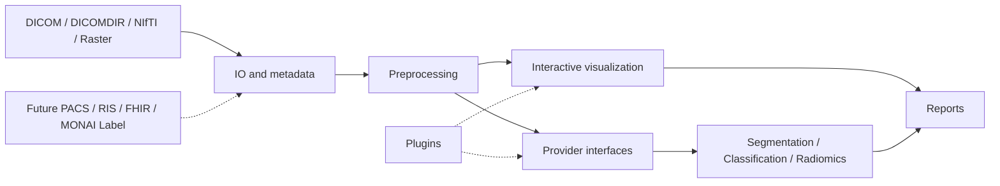
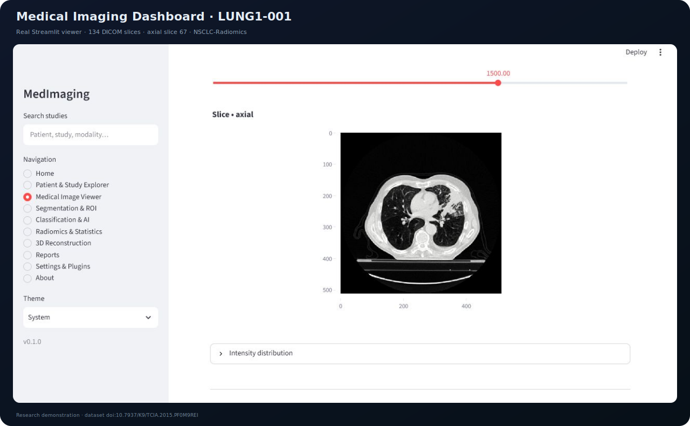

# medical-imaging-dashboard

[](https://python.org)
[](https://streamlit.io)
[](LICENSE)

## Overview

A modular, responsive Streamlit workspace for medical-image exploration,
quantitative analysis, AI predictions, radiomics, segmentation, reconstruction,
and publication-ready reporting. The application serves research and education
workflows and provides explicit adapters for future clinical integrations.

> This software is not a certified medical device and must not be used as the
> sole basis for diagnosis or treatment.

## Architecture



The domain package lives under `src/medical_imaging_dashboard`; UI pages depend
on typed imaging, visualization, report, session, and plugin services. External
models implement provider protocols rather than coupling PyTorch or MONAI to the
interface.

## Features

- DICOM series, DICOMDIR, NIfTI, PNG, TIFF, and JPEG support.
- Patient/study explorer, search, recent studies, favorites, and history state.
- Slice navigation, axial/coronal/sagittal MPR, window/level, zoom, and pan.
- MIP, MinIP, average projections, histograms, masks, and ROI overlays.
- Segmentation, classification, Grad-CAM, attention, radiomics, statistics,
  model-comparison, and image-quality extension points.
- PyVista/VTK 3D volume backend and Plotly interactive charts.
- PDF, CSV, Excel, JSON, HTML, and PNG report/figure paths.
- Entry-point plugins, configuration, caching-ready services, logging, controlled
  exceptions, responsive layout, and light/dark/system preferences.

## Screenshots



This image is a real capture of the Streamlit dashboard running the Medical
Image Viewer page with all 134 DICOM slices from the public
[NSCLC-Radiomics `LUNG1-001` case](https://www.cancerimagingarchive.net/collection/nsclc-radiomics/).
The viewer shows axial slice 67 through the project's `ImageLoader`, windowing,
volume navigation, and Plotly visualization code. Dataset DOI:
[10.7937/K9/TCIA.2015.PF0M9REI](https://doi.org/10.7937/K9/TCIA.2015.PF0M9REI).

## Project Structure

```text
medical-imaging-dashboard/
├── docs/                       # Architecture, use, plugins, deployment
├── assets/                     # Documentation visuals
├── notebooks/                  # De-identified research examples
├── scripts/                    # Launch and deployment helpers
├── tests/                      # Automated unit tests
└── src/
    ├── app.py                  # Checkout-friendly Streamlit entry point
    └── medical_imaging_dashboard/
        ├── pages/              # Dashboard modules
        ├── components/         # Reusable interface components
        ├── io/                 # DICOM/NIfTI/raster ingestion
        ├── preprocessing/      # W/L, normalization, resampling, denoising
        ├── visualization/      # MPR, projections, plots, 3D grid
        ├── reports/            # PDF/CSV/XLSX/JSON/HTML
        ├── plugins/            # Entry-point discovery and contracts
        ├── integrations/       # AI/imaging provider protocols
        ├── config/             # Validated settings
        └── session.py          # History, favorites, bookmarks
```

## Installation

Use Python 3.12:

```bash
python -m venv .venv
# Windows: .venv\Scripts\activate
# Linux/macOS: source .venv/bin/activate
python -m pip install --upgrade pip
pip install -e ".[ai,volume,dev,docs]"
```

For a lightweight 2D viewer, `pip install -e .` omits large AI and VTK packages.
PyRadiomics installation can require platform build tools or a compatible wheel.

## Usage

```bash
streamlit run src/app.py
# or, after installation:
medical-imaging-dashboard
```

Open `http://localhost:8501`. Only upload de-identified images. Use the image
viewer for MPR/windowing/projections and the feature page for CSV radiomics data.

## Dashboard Modules

Home; Patient Management; Study and Series Explorer; Metadata Viewer; Medical
Image Viewer; Segmentation and ROI; Classification and AI Predictions; Model
Comparison; Statistics and Quality Metrics; Radiomics and Feature Visualization;
3D Reconstruction; Report Generator; Plugin Manager; Settings; About.

## Supported Formats

| Format | Support | Notes |
|---|---:|---|
| DICOM | Yes | Instances and spatially sorted series |
| DICOMDIR | Yes | Hierarchy/record discovery |
| NIfTI | Yes | `.nii` and `.nii.gz` |
| PNG / TIFF / JPEG | Yes | 2D grayscale and color images |

## Examples

See [usage documentation](docs/usage.md), module docstrings, and `tests/` for
small executable examples. Keep notebooks free from PHI and large binary data.

## Roadmap

- Validated MONAI Label and foundation-model providers.
- DICOM SEG/SR, RTSTRUCT, FHIR ImagingStudy, PACS/RIS via DICOMweb.
- Federated learning and experiment provenance.
- REST API, background jobs, authentication, and role-based access.
- Docker/Kubernetes reference deployment and cloud object storage.

## Citation

Use [`CITATION.cff`](CITATION.cff) to cite this release.

## License

[MIT](LICENSE)

## Contributing

See [`CONTRIBUTING.md`](CONTRIBUTING.md). Contributions require type hints,
docstrings, tests, formatting, and explicit attention to privacy and leakage.

## Future Work

The provider and plugin boundaries are designed for deep learning, foundation
models, federated learning, MONAI Label, FHIR, PACS/RIS, DICOM-SR, cloud
deployment, Docker, Kubernetes, and REST services without rewriting core IO.
